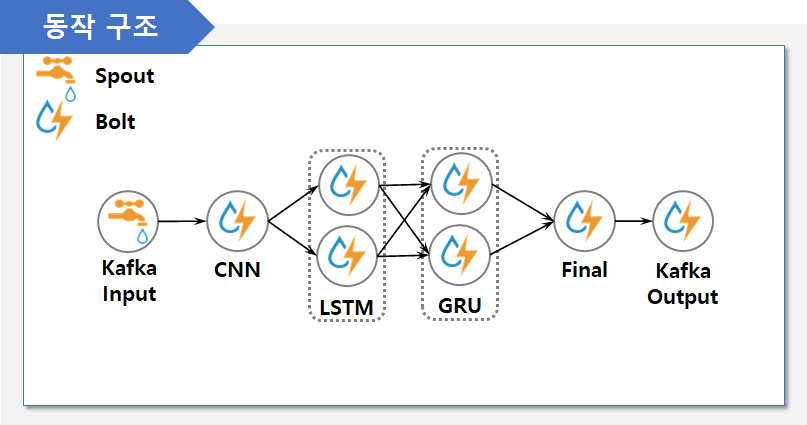

# 악성 URL 탐지 모델의 분산 병렬 처리 기법
성능 향상을 위해 앙상블 기법 중 스태킹을 적용한 악성 URL 탐지 모델을 사용하고,
악성 URL 탐지 모델에 사용된 모든 모델들을 스톰의 각 볼트로 실행시키는 분산 모델

## 분산 병렬 처리 알고리즘 

- IS: Independent Stacking
    - 악성 URL 탐지 모델에 사용된 CNN, LSTM, GRU, FC layer를 모두 독립적으로 실행
    - 상대적으로 시간이 오래 걸리는 LSTM, GRU 볼트는 병렬성을 높여 지연시간을 줄임
    - FC layer 볼트에서 앞의 세 볼트에서 전송된 데이터를 매핑하고 추론 진행
- SS: Sequential Stacking
    - 악성 URL 탐지 모델을 분리하지 않고 하나의 볼트에서 실행
    - Sequential 스태킹 볼트의 병렬성을 높여 지연시간을 줄임
- SSS: Semi-Sequential Stacking
    - SS 기법에서 추론 시간이 짧은 FC layer를 분리하여 실행
    - 추론 시간이 긴 BaseModel 볼트는 병렬성을 높여 지연시간을 줄임
- SIS: Stepwise-Independent Stacking
    - 악성 URL 탐지 모델을 분리하여 독립적으로 실행
    - 각 모델의 결과값은 입력데이터와 함께 단계적으로 전송

